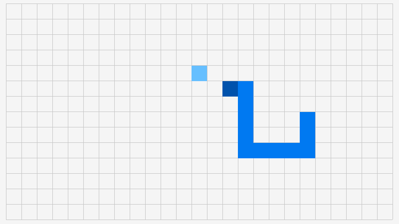

# ray-cyber
Complete [raylib 5.0](https://github.com/raysan5/raylib) bindings for [Cyber](https://cyberscript.dev)!
Bindings auto-generated from [cbindgen.cy](https://github.com/fubark/cyber/blob/master/src/tools/cbindgen.cy).

Start using by importing the URL from your script.

# Requirements.
* [Cyber v0.4-dev](https://github.com/fubark/cyber/releases/tag/latest)

# Instructions.
1. [Install Cyber](https://github.com/fubark/cyber#install)
2. Create a new cyber script `game.cy`:
```text
use rl 'https://github.com/fubark/ray-cyber'

rl.InitWindow(800, 600, 'Hello')
rl.SetTargetFPS(60)

-- Main game loop
while !rl.WindowShouldClose():
    -- Do game update...
    rl.BeginDrawing()
    rl.ClearBackground(rl.RAYWHITE)
    rl.DrawText('Congrats! You created your first window!', 190, 200, 20, rl.LIGHTGRAY)
    rl.EndDrawing()

rl.CloseWindow()
```
3. Run the game!
```sh
cyber game.cy
```

# More examples.
```sh
git clone https://github.com/fubark/ray-cyber
cd ray-cyber
```
## Snake
```sh
cyber examples/snake.cy
```


## Asteroids
cyber examples/asteroids.cy

https://user-images.githubusercontent.com/94020660/219881427-1244fd8d-29da-4a72-87bb-fcef46de650a.mp4

## Clash
cyber examples/clash.cy

https://user-images.githubusercontent.com/94020660/219976051-ea658da6-e46b-4bbf-b191-f73151efa309.mp4

# Troubleshooting.
Cyber caches the Raylib dependencies into `~/.cyber`. After an upgrade to Cyber or Raylib, repull the dependencies with `-r`:
```sh
cyber -r game.cy
```
